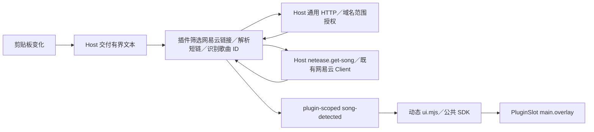

# 插件开发与使用

Nons 在现有播放器上增量提供 `Manifest + WASM Backend + React Frontend + Contributions`。网易云仍是宿主的数据源，插件不接管搜索、歌单、登录或播放核心。第一版随包分发灵动岛，默认关闭。

## 架构与文件

| 部分         | 位置与职责                                                                                           |
| ------------ | ---------------------------------------------------------------------------------------------------- |
| Rust Host    | `app/src-tauri/src/plugins/`：Manifest、安装、管理、Wasmtime、权限、事件、存储、剪贴板与资源协议     |
| 公共 ABI     | `plugins/wit/plugin.wit`：`nons:plugin@1.0.0`；Guest 初始化、关闭、方法调用；Host 高层 Capability    |
| React Host   | `app/src/plugins/`：动态模块、贡献 registry、PluginSlot、PluginPageHost、生命周期与 SDK              |
| 公共类型     | `packages/plugin-sdk/`：独立 `@app/plugin-sdk` 类型包，不引用宿主源码                                |
| 真实插件     | `plugins/netease-island/`：独立 Rust Component 与 React UI                                           |
| 构建         | `scripts/build-plugin.mjs`、`plugin-build-ui.mjs`、`package-plugin.py`：两端构建、React 外部化与 ZIP |
| 测试 fixture | `plugins/runtime-fixture/`：资源耗尽／错误验证，不随包安装                                           |

宿主启动、IPC 和协议注册接入原 `lib.rs`；歌曲读取继续使用 `netease.rs` 的现有 Client 和曲目解析。App 增加通用 Provider／Slot，已有工作区和导航增加插件页面分支，设置增加插件管理。Theme 共享原偏好与 CSS tokens，播放 facade 订阅原状态及进度，不创建另一套播放器。

职责归属见 [插件职责边界](adr/0005-plugin-capability-boundary.md)。通用能力提供系统操作；播放器领域能力复用已有业务服务；插件组合这些能力完成自己的业务。下面列出的接口为当前实现，不代表提前实现所有系统能力。

## 构建与安装

一次性准备：项目仍要求 Rust 1.95、Node/pnpm、Python 和原 GStreamer 开发运行时。另安装：

```powershell
cargo install cargo-component --version 0.21.1 --locked
rustup target add wasm32-unknown-unknown
cd app
pnpm install --frozen-lockfile
pnpm plugins:build
```

构建脚本先执行：

```powershell
cd plugins/netease-island/backend
cargo component build --release --target wasm32-unknown-unknown --locked
```

Cargo Component 根据 WIT 生成 `src/bindings.rs`，产出真正的 Component。生成的 bindings 与 target 不提交；Cargo.lock 提交。宿主只链接 Nons WIT，不提供任意 WASI filesystem、network、clipboard 或 process imports。

React 从 `frontend/index.tsx` 构建 ESM。TypeScript 检查使用公开 SDK 类型；React、JSX runtime 和 SDK 保持 external，并重写到同一插件 URL 下的 `_host/` 合成模块。桥接引用宿主 React singleton，产物检查拒绝 React 副本。动态 chunk 放入 `assets/`；样式可使用宿主 CSS tokens、组件类名或插件自己的 style／资产，不依赖宿主源码路径。

默认产物：

```text
app/src-tauri/bundled-plugins/netease-island/
  manifest.json
  backend.wasm
  ui.mjs
app/src-tauri/bundled-plugins/netease-island.zip
```

`pnpm dev` 与 Tauri 打包前会构建插件。正常宿主首次启动枚举随包插件并安装为关闭状态；之后卸载不会自动补装。构建目录不是源码提交内容。

设置 → 插件可安装目录或 ZIP，ZIP 根必须直接包含 `manifest.json`。安装复制到 `<app_data>/plugins/<id>/`，不在用户选择的来源目录运行，不支持覆盖同 ID 插件。启用前查看权限并勾选信任说明。管理支持重新发现、加载、卸载运行实例、重新加载、停用和删除；删除默认保留配置、独立存储和专属数据目录，主动关闭保留选项后才清理。当前没有远程安装、市场或自动更新。

## Manifest

编辑器 schema：`plugins/manifest.schema.json`。Rust 是运行时权威校验器，额外验证 SemVer、API 范围、路径、Windows 保留名、扩展引用、权限和文件存在性。

```json
{
  "id": "netease-island",
  "name": "灵动岛",
  "version": "1.0.0",
  "backend": "backend.wasm",
  "frontend": "ui.mjs",
  "permissions": ["clipboard:read", "http:request", "music:metadata", "ui"],
  "httpHosts": ["music.163.com", "y.music.163.com", "m.music.163.com", "163cn.tv"],
  "engines": { "app": "^1.0.0", "pluginApi": "^1.0.0", "uiApi": "^1.0.0" },
  "contributes": {
    "views": [{ "id": "island", "slot": "main.overlay", "export": "DynamicIsland" }],
    "pages": [],
    "navigation": []
  }
}
```

backend／frontend 可独立省略，但至少有一个入口。UI 贡献必须声明 frontend 与 `ui`。未知字段或权限拒绝加载；改动已安装插件的版本或权限需要重新安装并确认。commands、menus、settings、shortcuts 仅保留声明字段，当前不执行。contextMenus 的歌曲入口已执行，见下节。

`http:request` 与 `httpHosts` 一同声明，域名最多 32 个，接受精确的小写 DNS 域名或单独的 `*` 项；`*` 匹配任意 DNS 域名，不支持 `*.example.org` 等子域通配符。URL 仍不允许非 HTTP(S) 协议、嵌入凭证、非默认端口、IP 或单标签主机名。启用前显示域名范围；包含 `*` 时以敏感权限高亮并警告插件可向任意域名发送其可读取的数据，与账户凭证同时授权时 Cookie 也可能被发送到其他网站。授权记录绑定插件版本、权限与域名集合，重启后范围变化也需重新确认。历史授权没有范围记录时先保持关闭，用户重新确认后启用；旧 `clipboard:music-links` 仅保留安装识别与升级提示，不再执行，也不转换为原文读取权限。灵动岛 1.3.0 需重新安装并授权。

## Host Capability 与 SDK

WIT Host 的 `call(operation, args-json)` 返回 JSON 或业务错误，身份来自 Store，Guest 不能指定另一个 pluginId。当前操作：

| 操作                     | 权限                               | 行为                                                                                            |
| ------------------------ | ---------------------------------- | ----------------------------------------------------------------------------------------------- |
| `clipboard.read-text`    | `clipboard:read`                   | `{}` 读取当前剪贴板文本；变化通过 `event:clipboard-text` 的 `{text}` 交付后端                   |
| `http.request`           | `http:request` + `httpHosts`       | `{url,method?,timeoutMs?,responseType?}` 请求授权域名，返回 `{status,headers,body}`             |
| `netease.get-song`       | `music:metadata`                   | `{id}` 查询宿主网易云歌曲信息，返回 PluginSong                                                  |
| `events.emit`            | 活跃加载实例                       | `{event,payload}` 发布自己的事件                                                                |
| `storage.get/set/delete` | `storage`                          | 操作自身的 JSON 键值空间                                                                        |
| `player.read`            | `player:read`                      | 读取经过裁剪的播放状态，不提供本地文件路径                                                      |
| `player.control`         | `player:control`                   | pause、resume、next、previous、stop，进入既有播放命令队列                                       |
| `netease.play-song`      | `player:control`、`music:metadata` | `{id,mode: "now" 或 "next"}` 使用宿主有界歌曲缓存，立即播放替换队列，下一首播放插入当前曲目之后 |

`music.get-song` 和 `player.play-song` 保留为旧调用名的兼容别名；新实现使用 `netease.*` 明确来源。配置与文件操作见 [插件配置开发](plugin-configuration.md)。

公开 React API：

| API                        | 返回／用途                                                                                                             |
| -------------------------- | ---------------------------------------------------------------------------------------------------------------------- |
| `usePluginBackend()`       | `call<T>(method, args?)`；自动绑定身份与加载代次                                                                       |
| `usePluginClipboard()`     | `readText()` 读取文本；`subscribe(callback)` 订阅文本变化并返回清理函数；需 `clipboard:read`                           |
| `usePluginHttp()`          | `request({url,method?,timeoutMs?,responseType?})`；需 `http:request` 与声明域名                                        |
| `useNetease()`             | `getSong(id)` 查询网易云歌曲，`playSong(id,mode)` 立即／下一首播放；读取需 `music:metadata`，播放另需 `player:control` |
| `usePluginEvent<T>(event)` | 当前事件最新 payload；订阅随组件卸载清理                                                                               |
| `usePluginStorage()`       | 异步 get／set／delete；缺失值为 null                                                                                   |
| `usePluginNavigate()`      | 在当前插件命名空间内导航，参数为 `/child` 等相对插件根路径                                                             |
| `usePluginRoute()`         | 当前插件的 pathname 和 search                                                                                          |
| `usePlayer()`              | 原播放状态和进度；读取需 player:read，control 还需 player:control                                                      |
| `useTheme()`               | 原主题偏好 light／dark／system；实际颜色使用宿主 CSS tokens                                                            |
| `useCoverSource()`         | 复用宿主封面缓存和失败回退                                                                                             |
| `Button`                   | 宿主已有 Button；不打包另一份 UI 实现                                                                                  |
| `Progress`                 | 宿主已有 Progress；`value`／`max` 使用相同单位，`value: null` 表示进度未知，支持 `aria-label`                          |
| `SongArtists`              | `{song}` 复用宿主 ArtistLinks，按结构化艺术家 ID 跳转宿主艺术家页，需 ui                                               |
| `SongLikeButton`           | `{song,onError}` 复用宿主收藏按钮和账号状态，收藏至我喜欢的音乐，需 ui；未登录、收藏状态未就绪及提交中禁用             |
| `useSongPlayback()`        | `(id,mode) => Promise<void>`，使用 scoped Host Capability，需 player:control 和 music:metadata                         |

SDK 不要求手写 pluginId。所有 SDK 请求经过 `nativeCall` 和 scoped IPC；禁用／reload 后即使 Promise 晚返回，SDK 也拒绝旧结果。事件内部命名为 `plugin:<id>:<event>`，共用 Tauri transport，但 SDK 只读取自身 Scope。订阅在实例卸载时删除；每实例只保留有界的最新事件，不承诺持久历史或初始化之前的事件重放。

可选模块 `activate()` 可以返回清理函数；清理会在停用、reload 和卸载时调用。组件应使用 React effect 清理自己的定时器及其他副作用。

## 灵动岛数据流



Host 自动观察新变化，不在启动时重放旧内容；插件可以显式调用 `readText()` 读取当前文本。没有已加载且授权的插件时停止监听。Windows 使用 clipboard-win 的事件 Monitor，文本读取与其他平台观察复用 clipboard-rs。原文最多 16KiB，通过 scoped 事件交付授权实例；宿主合并待处理变化，消费或停止监听后清理待处理原文，不写剪贴板、不持久化或记录内容。前端订阅清理函数可重复调用，停用自动清理；旧加载代次的事件与异步结果被拒绝。

通用 HTTP 复用独立连接池，当前支持 GET／HEAD、UTF-8 文本或仅响应头；每次请求最多 3 秒、响应头 4KiB、文本正文 8KiB、URL 2048 字节。宿主不附带网易云 Cookie，不自动跳转，不缓存响应；收到跳转后由插件决定是否继续请求，每次都校验授权域名、HTTP(S)、账号密码及默认端口。停用后取消正在等待的请求；接口上限仍受现有 IPC 总大小约束。

网易云域名、歌曲 URL 格式和跳转规则全部在 `plugins/netease-island/backend/src/links.rs`。插件最多提取 4 个候选，优先直接歌曲链接；短链共享最多 3 次请求，每次 500 毫秒，以给后续 3 秒元数据查询留出 WASM 的 5 秒执行预算。每一步检查网易云域名，支持 HTTP redirect 和相对跳转，不执行网页脚本；选取首个可识别的歌曲。HTTP 和查询失败保留实例，等待后续复制。

Guest 查询歌曲失败时不产生预览，保留实例以等待后续复制。成功时发出包含结构化艺术家信息的 Song DTO；React 插件绘制封面、标题、可点击歌手、关闭与操作区域。新歌曲替换旧预览；同歌曲 30 秒内去重；8 秒后收起，鼠标悬停或键盘聚焦暂停倒计时，Escape／关闭按钮可收起。1.1.0 新增 player:control 权限，立即播放替换队列，下一首播放使用既有 PlayNext 命令；收藏复用宿主账号与写入缓存失效规则，成功与失败均提供反馈。切换歌曲时重建操作状态，旧请求不覆盖新提示。已安装的 1.0.0 需重新安装新版并确认新增权限。

## 新 view／page 插件

新的项目沿用 `plugins/<id>/manifest.json`、可选 backend 与 `frontend/index.tsx` 结构，更新各 Cargo package 名和 SDK tsconfig 路径，再运行：

```powershell
node scripts/build-plugin.mjs <id>
```

view 导出命名 React Component，并在 views 中关联导出与 `main.overlay`。页面通过 pages 与 navigation 声明，例如：

```json
{
  "pages": [{ "id": "inspector", "path": "/", "export": "InspectorPage" }],
  "navigation": [{ "id": "inspector-entry", "label": "检查器", "page": "inspector" }]
}
```

页面入口统一为 `/plugins/<id>/*`，使用现有应用内历史而非新建全局 router。按最长页面路径前缀选择 contribution；同一页面的子路径变化保留组件状态，离开该页面后卸载。组件从 SDK 获取子路径，并用 `usePluginNavigate()` 导航；不得跳出自身命名空间。没有额外交付网易云示例页面，桌面探测中的临时页面仅用于验证。

工作区插件页面由宿主统一包裹 `MusicPage`，插件只渲染页面内容；布局与滚动验收遵循 [页面 shell 与滚动](architecture.md#页面-shell-与滚动)。

## 边界与资源预算

- WASM：64MiB 线性内存、1000 万 fuel／调用、5 秒执行期限；Host 网络查询 3 秒；异步等待可取消，epoch 与 fuel 防止 guest 独占线程。最多同时加载 4 个 WASM 插件，单实例最多 16 个待处理请求。
- IPC／事件／存储单值最多 64KiB；事件最多 32 次／秒；存储每插件 1MiB；安装最多 1024 文件、64MiB 解压总量，WASM 入口 16MiB，UI／资源单文件 8MiB。
- SDK、元数据和资源都校验加载代次。trap／超时／资源耗尽撤销该实例，普通 Guest 业务错误保留实例。原播放队列及音频线程不承担插件执行。
- `plugin://` 服务只允许活跃插件的前端入口、assets 和合成 Host 模块；规范化路径、拒绝链接／junction、限制类型与大小、设置 MIME、no-store 和有限 CORS。不开放通用 filesystem scope。
- React 前端是受信任代码，与主 UI 共享 WebView。主窗口连续隐藏或最小化 3 分钟后，非私人 FM 自动续播状态下会释放整个 WebView：前端任务（含前端插件的下载、计时器与临时状态）随之停止，插件 WASM 后端保留；重新打开时重新加载前端并发送 ready，剪贴板订阅在释放期间暂停。需要恢复的插件业务应通过 SDK 持久化状态。SDK 身份、存储、事件和路径约束不等于防恶意 JS 沙箱；它仍可能直接操作 DOM、调用其他可见宿主接口或自行创建副作用。单个模块的 JS／浏览器 ESM 缓存无法强制回收，主线程循环也不能由 WASM fuel 终止。只安装可信前端。
- Store 上限仅覆盖 guest 线性内存等资源，不代表 Wasmtime JIT、Host、WebView 或全进程内存上限。当前没有独立 WASM worker 进程、签名或权限撤销后的 JS 强制终止；频繁 reload 的 ESM 模块记录可能留在 WebView，必要时重启应用。
- Windows 已验收；macOS/Linux 原生构建、播放与剪贴板观察尚需对应环境验证，Linux 当前为 X11 后端。Release 的 GStreamer 裁剪和打包仍沿用既有未完成状态。

## 验证

准备测试 Component，再运行既有检查：

```powershell
cd app
pnpm plugins:build
pnpm plugins:fixtures
pnpm test
pnpm build
cd ..
./scripts/native.ps1 -Task check
./scripts/native.ps1 -Task test -ExtraArgs @('--','--test-threads=1')
./scripts/native.ps1 -Task clippy -ExtraArgs @('--all-targets','--all-features','--','-D','warnings')
```

显式的实际桌面探测：

```powershell
./scripts/probe-plugins.ps1
```

该脚本在独立的 `target/plugin-probe` 目录构建，隐藏窗口，使用独立临时插件数据库和空队列，读取现有网易云服务，自动验证 ESM 协议、React singleton、灵动岛、权限、停用及临时页面／导航。输入为合成剪贴板文本，不覆盖用户剪贴板；操作系统真实复制通知仍需手动验收。结束时清理本次探测的临时数据。该 feature 专供探测，正常构建不启用它。

本机 Windows x64、Rust 1.95、GStreamer 1.28.7 的检查结果记录在 `docs/implementation.md`。开发构建体积和单次端到端时间不能代表 Release 内存／响应预算；没有据此宣称插件平台“极轻”或“极快”。
配置编辑页面、配置 API 和目录授权见 [插件配置开发](plugin-configuration.md)。

## 歌曲菜单与独立下载插件

插件 API／UI API 1.1.0 增加歌曲菜单贡献；1.2.0 增加账户凭证、下载管理组件及暂停／继续传输。`contextMenus` 每插件最多 16 项，格式为 `{id,target:"song",source:"netease"或"local",label,export}`。宿主按曲目的真实来源筛选；本地音乐绑定的网易云歌词 ID 不改变来源。贡献处理方法接收 `(song, client)`；song 只含公开元数据及 `{kind:"netease",id}`／`{kind:"local"}`，不交付本地路径。

菜单项使用可选 `icon` 图标标识，当前支持 `download`（Download）和 `layout-grid`（LayoutGrid）；省略或未知标识默认显示 LayoutGrid。标识遵循 manifest 的 ID 格式限制；新增菜单的图标要求见 [项目约束](architecture.md#页面-shell-与滚动)。

可选 `activate(client)` 在模块加载时调用，旧的无参 activate 保持兼容。client 提供绑定身份和加载代次的 `call(operation,args)`、`openPage(path?)` 和 `openConfiguration()`；同样受宿主权限与取消检查。处理方法可返回提示文字，宿主复用歌曲操作通知显示。菜单点击不改变播放队列、不预取音频地址，停用立即撤销贡献，旧异步结果不可发布。

新增通用操作：

| 操作                     | 权限与限制                                                                                                                                                              |
| ------------------------ | ----------------------------------------------------------------------------------------------------------------------------------------------------------------------- |
| `secrets.get/set/delete` | `secrets`；`{key,value?}`，系统凭据库隔离为插件 ID／键，每插件 16 键、每值 16KiB；不访问播放器账号。卸载即使保留普通数据也清理凭据。                                    |
| `http.request`           | 增加 POST、可选 body 和有限请求头；正文 32KiB、请求头 16KiB、POST 响应头 16KiB，返回 cookies 数组。仍不自动携带宿主凭据、不跳转、不缓存，正文仍最多 8KiB、总期限 3 秒。 |
| `transfers.start`        | `http:transfer`、httpHosts 域名范围和目标根文件权限；`{url,root,path,maxBytes?}` 返回 `{id}`。仅 GET，无账号头、无跳转，直接流式写新文件。                              |
| `transfers.get/cancel`   | `http:transfer`；`{id}` 返回 `{id,state,bytes,total,error}`；ID 绑定插件与代次，不包含 URL。                                                                            |
| `files.publish`          | 目标根文件权限；`{root,path,to}`，使用同根 hard link 后移除临时文件，目标存在时失败，避免覆盖。文件系统须支持硬链接（Windows 推荐 NTFS）。                              |

传输每插件最多 2 个、全局最多 8 个，最多保留 128 个状态；单文件上限 512MiB、累计网络读取等待 10 分钟、连接／单次读取期限 30 秒；暂停不计入读取等待，单连接最多保留 24 小时。文件块在阻塞线程写入，文件权限撤销会关闭句柄，后续写入和发布被拒绝。实例停用取消网络操作；授权撤销或停用后可能保留未完成 `.part`，不越权清理外部目录。

`plugins/netease-download` 是独立前端插件，不默认构建或随安装包分发。网易云 EAPI 协议、下载资格与音质选择全部在插件内；账号复用宿主显式授权的实时凭证，插件不另建登录。不调用本体播放 URL 或导出播放缓存。通过下载接口选择资源，拒绝试听和低于最低音质的资源；凭据与 URL 只在下载流程内存中使用，不写插件存储。

```powershell
pnpm --dir plugins/netease-download install --frozen-lockfile
node scripts/build-plugin.mjs netease-download .local/plugins/netease-download
```

在插件管理中安装 `.local/plugins/netease-download.zip` 并授权。配置默认音质、允许降级、最低音质与授权保存目录；右键网易云歌曲选择“下载”。缺少目录时打开插件配置；缺少账号时提示在 NonsPlayer 登录，所选歌曲保留。配置完成后继续等待任务。下载管理只有已下载单曲／正在下载分类，支持歌名、歌手、专辑搜索及打开授权目录；每项可暂停、继续和删除，没有独立扫码、歌曲链接／ID 输入框或批量操作，页面关闭后下载继续。新增凭证权限需重新安装并授权新版插件。

队列正常串行，暂停后允许下一项继续，最多两个传输（含暂停）并存；最多保留 32 项，新任务保存配置快照；修改设置只影响新任务与显式重试。重复添加待处理歌曲去重。先传输 `.part`，核对预期大小和音频头后以实际格式发布；重名失败不覆盖。重启后的中断任务显示重试，重新解析 URL 并从头下载，不承诺续传。完成文件不进入播放缓存，已有本地音乐目录同步可正常收录；目录授权不会自动加入曲库。

验证包括 EAPI 独立加密向量、音质与权限失败、在线／本地菜单来源、队列去重与配置快照，以及 Rust 文件传输、取消、目录撤权和不覆盖测试。真实账号下载需交互验收；macOS/Linux 与非 NTFS 目录仍需对应环境验证。

### API 1.2.0 下载管理能力

- `netease.account-credentials`：需 `account:credentials`；返回 `{cookie: string|null,generation: number}`，实时读取当前网易云会话。启用确认单独强调风险；旧授权不可自动升级。
- `transfers.pause/resume`：需 `http:transfer`，参数 `{id}`；暂停保持文件与连接，停止读取／写入，继续使用同一传输。停用、目录撤权或删除仍取消传输；重启后的中断下载重新解析并从头重试。
- `files.resolve`：按目录文件权限与 `{root,path}` 校验授权文件，返回该授权目录内的 `{path}`；不接受未授权绝对路径。
- `files.play`：另需 `player:control`；`{root,path,track}` 在宿主重新解析文件位置，强制以本地文件来源进入既有播放队列，不信任传入的 source 路径。
- `files.open-directory`：按目录权限校验 `{root}`，打开对应根目录，不接受外部路径。
- React SDK 复用 `SongIdentity`、`DownloadedSongList`、`Input`、`Icon` 及 Tabs 系列组件。`SongIdentity` 使用宿主 `TrackIdentity`；`DownloadedSongList` 接收 `{song,root,path,completedAt?,size}` 数组，复用虚拟化 `TrackList`，显示专辑、下载时间与文件大小并播放本地文件。缺失文件独立报告，其余文件可正常显示。

## 收藏详情 tab 扩展

歌单、专辑和本地收藏详情默认提供“歌曲”tab，沿用发现页的 Tabs 组件；宿主不提供评论业务。可信插件可在 `activate(client)` 中调用 `client.registerCollectionTab(...)` 插入内容，例如：

```tsx
import type { PluginClient, PluginCollection } from '@app/plugin-sdk'

function Comments({ collection }: { collection: PluginCollection }) {
  return <section aria-label="歌单评论">{collection.name} 的插件内容</section>
}

export function activate(client: PluginClient) {
  return client.registerCollectionTab({
    id: 'comments',
    label: '评论',
    kinds: ['playlist'],
    sources: ['netease'],
    component: Comments
  })
}
```

需要 manifest 声明 `frontend` 和 `ui` 权限，无需新增 manifest contribution 字段。`kinds`／`sources` 省略时匹配全部已接入的收藏详情；网易云艺术家页保留既有歌曲／专辑标签，目前不接入该扩展。每插件最多 8 个 tab，ID 为 1–64 字符的小写字母、数字或连字符且以字母开头，标题最多 40 字符；同一实例内 ID 不可重复，不同插件独立命名空间。组件可使用现有 SDK，并受插件 Scope、错误隔离及加载代次约束。

组件收到 `{ collection }`：`source`、`kind`、`id`、`name`、`subtitle`、`cover` 和 `trackCount`。网易云 ID 为数字，本地 ID 为曲库标识；仅交付 HTTP(S) 封面，不暴露本地封面路径。网络访问与登录凭证仍需分别申请对应权限，宿主不会代为提供评论接口。

注册返回可重复调用的清理函数；插件停用、重载、卸载或激活失败时宿主自动清理。未完成加载的实例不会展示 tab；选中 tab 消失后自动回到“歌曲”。只挂载当前选择的插件内容，切换收藏重置到“歌曲”，组件应清理自身请求、订阅和定时器。
